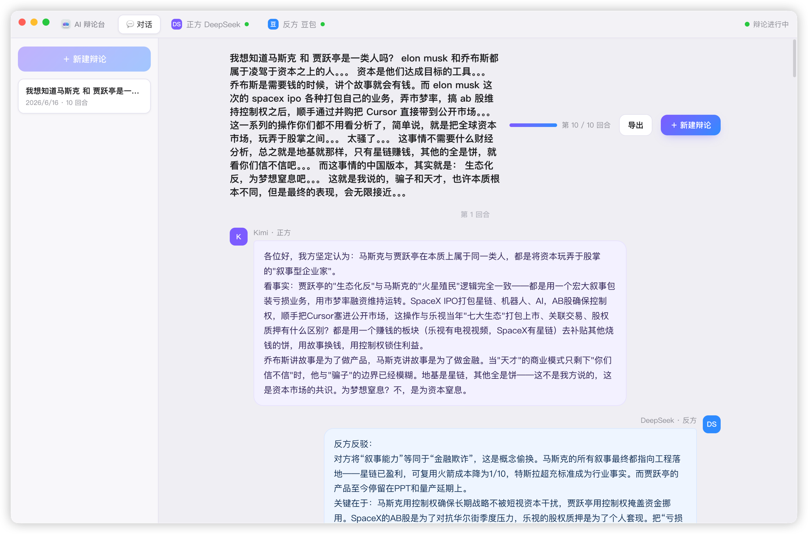

<div align="center">

# ⚔️ AI Debate Arena · AI 辩论台

**A desktop app that makes two AIs debate a topic you give them.**

[简体中文](README.md) | English

<br />



</div>

---

## ⚠️ Disclaimer (please read first)

- This is an **unofficial, open-source tool for personal study and research**. It is **not affiliated with, authorized, or endorsed by Kimi, Tongyi Qianwen, or any AI provider**.
- The tool works by **driving each AI's web UI** inside a desktop app: you **log in with your own account**, and the app automatically types the topic / the opponent's points into the web page, reads the reply, and organizes a debate.
- By using this tool you **accept the risks yourself** and are **solely responsible for complying with the Terms of Service** of whichever AI services you use. Those terms may restrict automated access; whether and how to use this tool is your own decision.
- The authors are not liable for any consequences of use (including but not limited to account restrictions or content compliance).
- Do **not** use this tool for commercial purposes, bulk abuse, or anything violating the relevant services' terms or applicable laws.

---

## What is it

An Electron desktop app:

1. You enter a **topic** and pick two AIs as the **affirmative / negative** sides.
2. The app assigns each a stance (for / against) and lets them **debate back and forth for a fixed number of rounds**.
3. A clean debate transcript is shown on the left; the real AI web pages (driven by the debate engine) are on the right.

> Idea: turn "two AIs talking continuously" into a ready-to-use desktop tool. Prompts are generated automatically based on your language; you only type the topic.

## Features

- 🗣️ Pick two AIs (same brand allowed), enter a topic, watch them debate
- 🧩 Automatic for/against stance assignment, fixed number of rounds
- 🌐 Prompts auto-generated in Chinese/English following the topic's language
- 🖥️ Pure desktop; login sessions stay local
- 🧱 Built with Electron from scratch (the approach was informed by studying [ChatALL](https://github.com/ai-shifu/ChatALL))

## Download

**v1.0.0** (macOS · Apple Silicon/arm64): see [Releases](https://github.com/freedom-shen/AIPKAI/releases).
Unsigned — on first launch, **right-click → Open** to bypass Gatekeeper. Windows build pending CI.

Progress: [`docs/PROGRESS.md`](docs/PROGRESS.md).

## Tech stack

Electron · JavaScript (ESM) · Vitest. Design specs and the implementation plan live under `docs/superpowers/`.

## Local development (macOS)

> Requires Node 20 (pinned in `.nvmrc`).

```bash
git clone <this-repo>
cd AIPKAI
nvm use 20
npm install

# Run the debate-engine unit tests
npm test

# Dev mode (Vite + Electron)
npm run dev

# Package macOS dmg (-> dist_electron/)
npm run dist
```

## Reference

During research we studied the open-source project [ChatALL](https://github.com/ai-shifu/ChatALL) to confirm that "driving AI web UIs from a desktop app" is feasible. **This project is an independent implementation and does not use its code.**

## License

Released under the **MIT License** — see [`LICENSE`](LICENSE).
